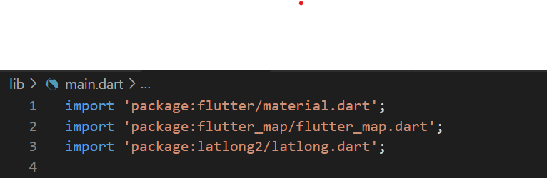
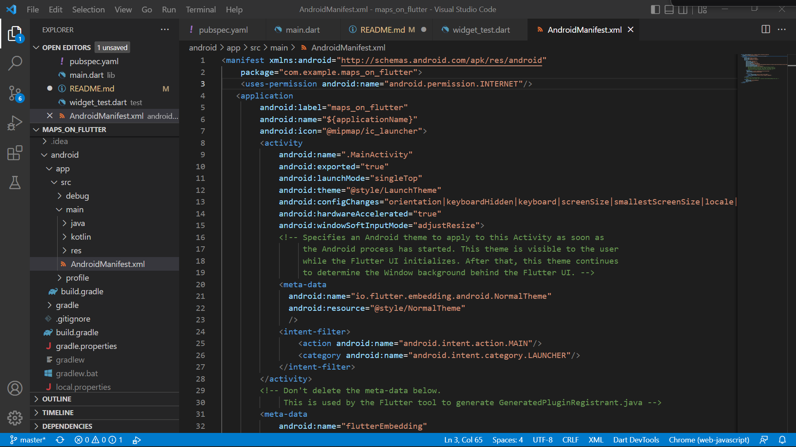
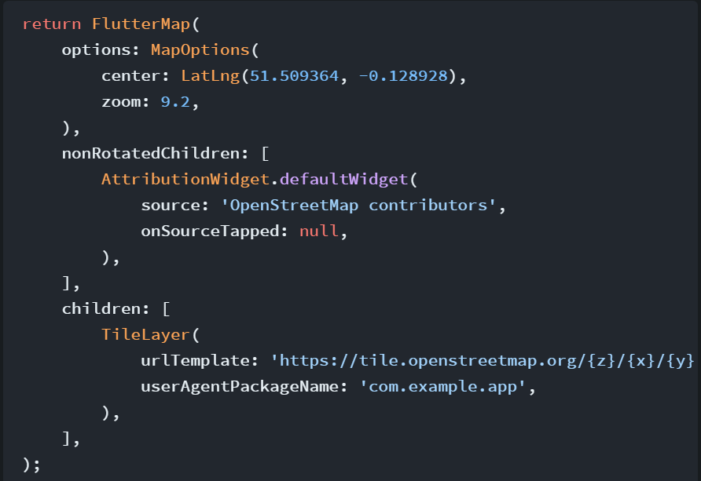
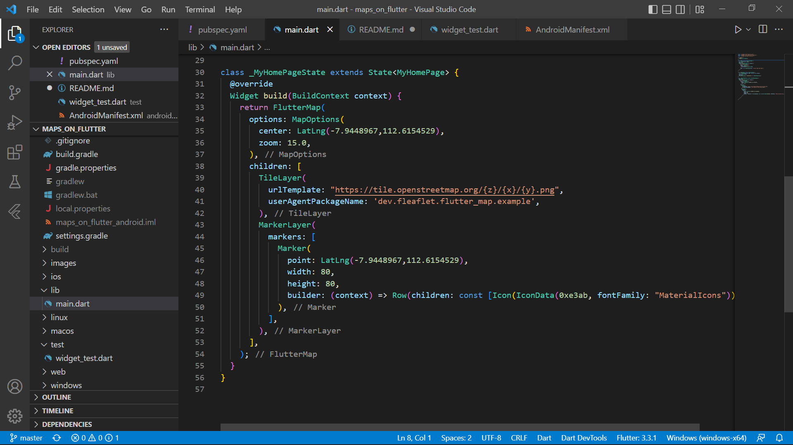
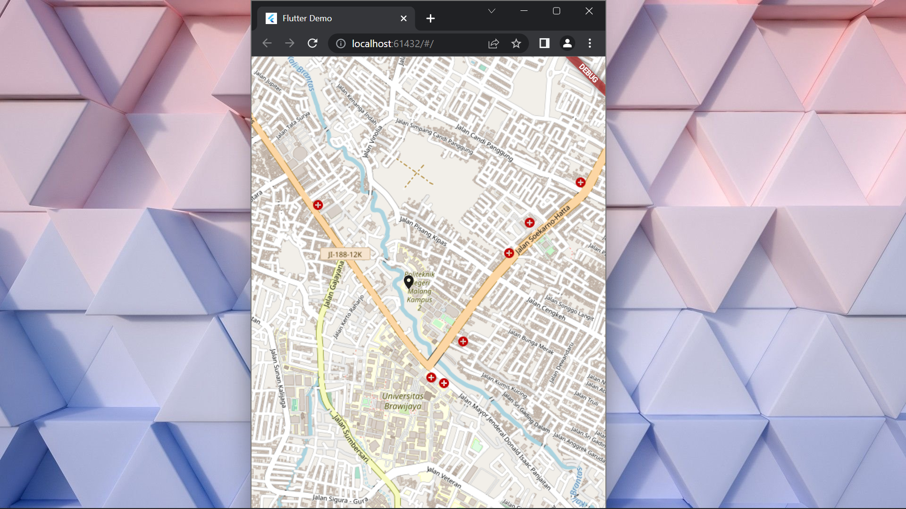

# **Tugas Pertemuan 27**
## **Project maps_on_flutter**

### Praktikum 1 : Installation
* Menambahkan package flutter_map dengan menambahkan pada file pubspec.yaml

* Menginstall package dengan mengimport pada file main.dart

### Praktikum 2 : Additional Setup
* menambahkan package latlong2 untuk menunjukkan objek latitude dan longitude. Selanjutnya lakukan import pada file main.dart

* manembahkan permission internet pada file AndroidManifest.xml

### Praktikum 3 : Input Code
* Menambahkan code dibawah ini pada file main.dart

* Menambahkan marker layer pada file main.dart

### **Hasil Run Project maps_on_flutter**

